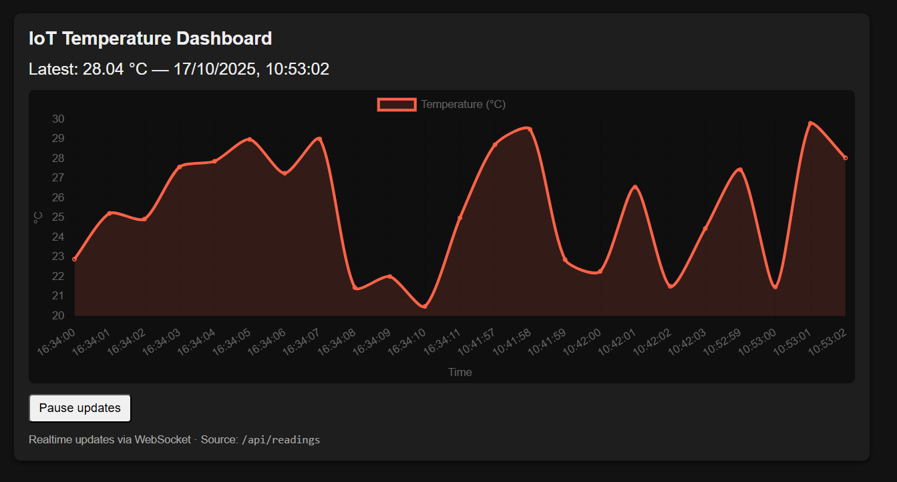
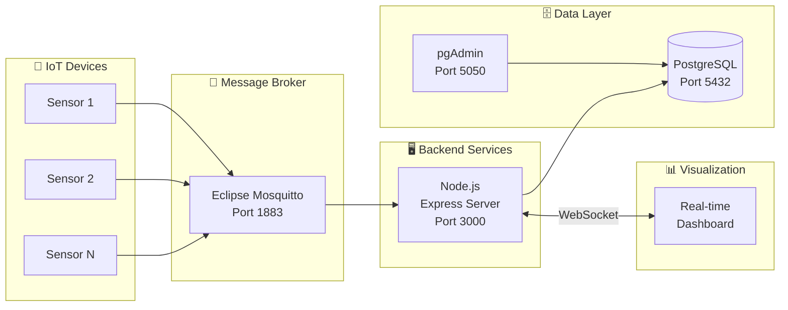

<div align="center">

# 🌐 IoT Sensor Data Pipeline

[](https://nodejs.org)
[](https://postgresql.org)
[](https://docker.com)
[](https://mqtt.org)
[](LICENSE)

**End-to-end IoT data pipeline: from sensor simulation to real-time dashboard visualization.**

*MQTT messaging • Node.js backend • PostgreSQL storage • WebSocket dashboard*



</div>

---

## 📋 Overview

A complete IoT data pipeline demonstrating the full journey of sensor data:

```
🔌 Sensor Simulator → 📡 MQTT Broker → 🖥️ Node.js Backend → 🗄️ PostgreSQL → 📊 Real-time Dashboard
```

This project showcases how to build a production-ready IoT infrastructure using modern containerized services.

---

## ✨ Features

| Feature | Description |
|---------|-------------|
| **📡 MQTT Messaging** | Eclipse Mosquitto broker for pub/sub communication |
| **🐍 Sensor Simulator** | Python script generating realistic sensor data |
| **🖥️ Node.js Backend** | Express server with MQTT subscription & DB persistence |
| **🗄️ PostgreSQL** | Time-series data storage with pgAdmin interface |
| **📊 Real-time Dashboard** | Chart.js visualization with WebSocket updates |
| **🐳 Fully Dockerized** | One command deployment with docker-compose |

---

## 🏗️ Architecture



---

## 🛠️ Tech Stack

| Layer | Technology | Purpose |
|-------|------------|---------|
| **Sensor Simulation** |  | Generate mock sensor data |
| **Message Broker** |  | MQTT pub/sub messaging |
| **Backend** |   | API & data processing |
| **Database** |  | Time-series storage |
| **Dashboard** |   | Real-time visualization |
| **DevOps** |   | Containerization |

---

## 🚀 Quick Start

### Prerequisites

- Docker & Docker Compose
- Python 3.8+ (for sensor simulator)

### 1️⃣ Start the Infrastructure

```bash
# Clone the repository
git clone https://github.com/surbalo1/iot-sensor-pipeline.git
cd iot-sensor-pipeline/iot-sensor-pipeline

# Start all containers
docker-compose up --build -d
```

### 2️⃣ Run the Sensor Simulator

```bash
# Create virtual environment
python -m venv venv
source venv/bin/activate  # Windows: venv\Scripts\activate

# Install dependencies
pip install -r requirements.txt

# Start simulator
python firmware/sensor_sim.py
```

### 3️⃣ Access the Dashboard

| Service | URL | Description |
|---------|-----|-------------|
| **📊 Dashboard** | [http://localhost:3000](http://localhost:3000) | Real-time sensor visualization |
| **🗄️ pgAdmin** | [http://localhost:5050](http://localhost:5050) | Database management UI |

---

## 📁 Project Structure

```
iot-sensor-pipeline/
├── 📄 docker-compose.yml      # Container orchestration
├── 📸 dashboard.png           # Dashboard screenshot
│
├── 🐍 firmware/               # Sensor simulation
│   ├── sensor_sim.py          # Python MQTT publisher
│   └── requirements.txt       # Python dependencies
│
├── 🖥️ backend/                # Node.js server
│   ├── Dockerfile             # Container definition
│   ├── app.js                 # Express + MQTT + WebSocket
│   ├── package.json           # Node dependencies
│   └── public/                # Dashboard frontend
│       ├── index.html
│       └── app.js             # Chart.js visualization
│
└── 📡 mosquitto/              # MQTT broker config
    └── config/
        └── mosquitto.conf
```

---

## 🔐 Default Credentials

### PostgreSQL
| Parameter | Value |
|-----------|-------|
| **User** | `iotuser` |
| **Password** | `iotpass` |
| **Database** | `iotdata` |
| **Host** | `db` (internal) / `localhost` (external) |
| **Port** | `5432` |

### pgAdmin
| Parameter | Value |
|-----------|-------|
| **Email** | `admin@admin.com` |
| **Password** | `admin` |

---

## 🐳 Docker Services

| Container | Image | Ports | Purpose |
|-----------|-------|-------|---------|
| `mqtt_broker` | `eclipse-mosquitto:latest` | 1883, 9001 | MQTT message broker |
| `pgdb` | `postgres:15` | 5432 | Database server |
| `pgadmin` | `dpage/pgadmin4` | 5050 | Database admin UI |
| `backend` | Custom Node.js | 3000 | API & Dashboard |

### Container Management

```bash
# Start all services
docker-compose up -d

# View logs
docker-compose logs -f

# Stop all services
docker-compose down

# Rebuild after changes
docker-compose up --build -d
```

---

## 💾 Database Backup

### Create Backup
```bash
docker exec -i pgdb pg_dump -U iotuser -Fc iotdata > ./backup_iotdata_$(date +%Y-%m-%d).dump
```

### Restore Backup
```bash
docker exec -i pgdb pg_restore -U iotuser -d iotdata < ./backup_iotdata_YYYY-MM-DD.dump
```

---

## 📡 MQTT Topics

| Topic | Direction | Description |
|-------|-----------|-------------|
| `sensors/temperature` | Publish | Temperature readings |
| `sensors/humidity` | Publish | Humidity readings |
| `sensors/+` | Subscribe | Wildcard subscription |

---

## 🔧 Configuration

### Environment Variables (Backend)

| Variable | Default | Description |
|----------|---------|-------------|
| `PGUSER` | `iotuser` | PostgreSQL username |
| `PGPASSWORD` | `iotpass` | PostgreSQL password |
| `PGDATABASE` | `iotdata` | Database name |
| `PGHOST` | `db` | Database host |
| `MQTT_BROKER` | `mqtt://mqtt_broker:1883` | MQTT broker URL |

---

## 🤝 Contributing

Pull requests are welcome! Feel free to:

1. Fork the repository
2. Create a feature branch
3. Submit a pull request

---

## 📄 License

This project is licensed under the MIT License.

---

<div align="center">

**Built with ❤️ for IoT enthusiasts**

[](https://github.com/surbalo1/iot-sensor-pipeline)

</div>
